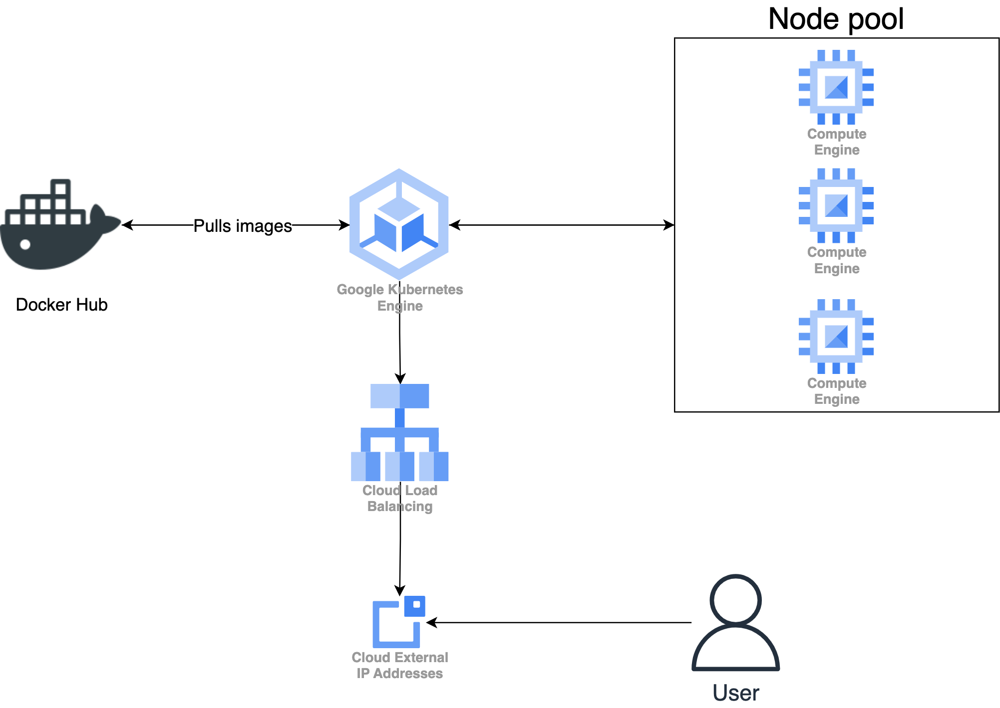

# Software Containerisation
This repository is contains the code and images for the assignment of Software Containerisation

## Architecture

### GCP architecture

Our GCP architecture contains the following resources:

* Google Kubernetes Engine
* Cloud Load balancer
* External IP Address
* Compute Engine virtual machines

The GKE hosts the Kubernetes engine, the Compute Engine machines are the nodes for the Kubernetes cluster.
The load balancer is created automatically by GCP because we are provisioning an ingress.
The external IP address is for attaching to the load balancer for the users to connect to.
In a production setting, we would also add a DNS and have the DNS resolve to the external IP address, but 
since this is a learning environment, then we did not reserve a domain.

## Terraform

We use Terraform to create the GKE cluster, node pool for the cluster and a static IP for the ingress to use.

The following steps are how to deploy terraform code for GCP. You need to have a GCP project up and running for this.
Make sure you are first authenticated properly with the gcloud auth (`gcloud auth login`).

1. `terraform init`
2. `terraform apply -var "project=<YOUR-PROJECT-ID>"`

The setup of GKE and node pools take a while so wait until they are set up.

### Cleanup

Run `terraform destroy -var "project=<YOUR-PROJECT-ID>` to destroy all the created cloud resources.

## Helm

1. Install the chart: `helm install helm-charts/todo-app --name-template demo`
2. Uninstall the chart: `helm uninstall demo`
3. Upgrade an image with the chart (example of upgrading todo-app-ui image):
`helm upgrade demo ./helm-charts/todo-app --set todo-app-ui.image.tag=1.0.3`

When installing the chart to a GKE cluster, do note that the ingress set up takes a couple of minutes.

## GKE

Run the following command to fetch the credentials for the GKE cluster:
`gcloud container clusters get-credentials vu-sc --region europe-west4-a `

## TLS/SSL Certificate

We create it using openssl in ./certs/.
1. `openssl req -x509 -newkey rsa:2048 -keyout key.pem -out cert.pem -days 5 -nodes -subj "/C=NL/ST=Noord-Holland/L=Amsterdam/O=VU/OU=Education/CN=<INSTANCE-IP>/emailAddress=<EMAIL>"`

## RBAC

We have created the following three roles:

1. readonly -- A readonly role that is meant to only allow to list and view specific resources in the cluster.

2. developer -- A role meant for the developers. The developer can read and update several resources and also
read all the core API resources.

3. contract-developer -- A role meant for contract developers who only work on certain projects. The role provides
a read, create and update permissions to specific resources in a specific namespace meant for the project.

   
## Presentation guides

### Show how to build and push the docker images

1. Build image with: `docker build -t <DOCKERHUB-USERNAME>/<IMAGE-NAME> .` under `./backend` or `./frontend`.
2. Push image to docker hub: `docker push <DOCKERHUB-USERNAME>/<IMAGE-NAME>`.

### Show how to deploy the application for the first time

1. Configure terraform with `terraform init` and `terraform apply -var "project=<YOUR-PROJECT-ID>"`.

2. Install the chart with `helm install helm-charts/todo-app --name-template demo`.

### Show how to scale the application horizontally

Scale the deployment with `kubectl scale`. For example, to scale up the frontend, do `kubectl scale --replica=3 deployment/todo-app-ui`.

### Show how to uninstall the application

1. Uninstall helm chart with `helm uninstall demo`.
2. Clean up terraform with `terraform destroy -var "project=<YOUR-PROJECT-ID>`.

### Re-building the application after a source code change

1. Build and push a new version of the image: `docker build --push -t andersnou/todo-app-ui:2.0.0 .`
   1.  For M1 CPU: `docker buildx build --platform linux/amd64 --push -t andersnou/todo-app-ui:2.0.0 .`
2. Upgrade the helm chart: `helm upgrade demo ./helm-charts/todo-app --set todo-app-ui.image.tag=2.0.0 -n todo-app`

### Upgrade application - Deployment rollout

1. Change the version of the image -- either by modifying the `values.yaml` or passing as a parameter.
   1. Pass the value: `helm upgrade demo ./helm-charts/todo-app -n todo-app --set todo-app-api.image.tag=2.0.0`
   2. Or by changing the file: `helm upgrade demo ./helm-charts/todo-app -n todo-app`

### Upgrade application - Canary update

Deploys X/2 number of canary pods where X is the number of pod replicas for the application. E.g.
X=4, then 4 pods are deployed for the application and 2 canary pods are deployed during deployment. Meaning that
33% of the traffic is routed to canary pods.

1. Deploy the canary pods: `helm upgrade demo ./helm-charts/todo-app -n todo-app --set todo-app-ui.canary.create=true --set todo-app-ui.canary.tag=2.0.0`
2. Validate that the new version is working
3. Change the image version of the UI to 2.0.0 in the `values.yaml`
4. Delete the canary pods: `helm upgrade demo ./helm-charts/todo-app -n todo-app --set todo-app-ui.canary.create=false`